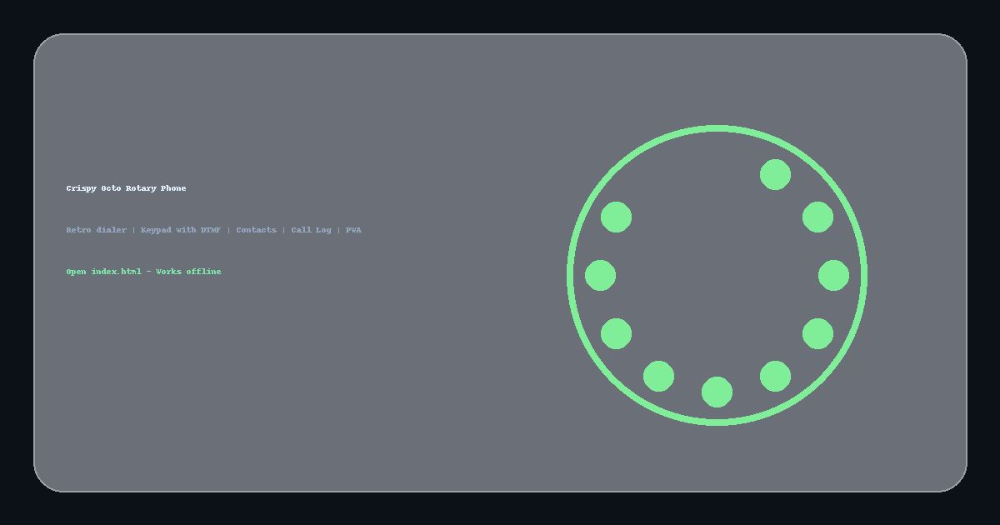

# 📱 Crispy Octo Rotary Phone  
**Retro Dialer • Modern UI • Offline-Ready**

<p align="center">
  
</p>

---

## ✨ Overview  
**Crispy Octo Rotary Phone** is a fun, retro-inspired phone dialer built entirely with **HTML, CSS, and JavaScript** — no build tools, no frameworks.  
Just open the file and enjoy:

- ✅ Rotary Dial with realistic physics  
- ✅ Keypad mode with DTMF tones  
- ✅ Contacts manager  
- ✅ Call log history  
- ✅ Light/Dark/System themes  
- ✅ Haptics & Sound toggle  
- ✅ PWA support (Installable, Offline Capable)

---

## 🧭 Features — Everything in One Glance  

### 🎡 Rotary Dial  
- Drag a number to the stopper  
- Release to dial  
- Authentic clicking sound pulses  
- Smooth and snappy animation  

### 🔢 Keypad + DTMF  
- Toggle to keypad mode  
- Real dual-tone DTMF synthesized with WebAudio  
- Perfect for UI/UX experiments  

### 👥 Contacts  
- Add new contacts  
- Auto-fill numbers  
- Quick Call  
- Long-term storage via `localStorage`  

### 📜 Call Log  
- Timestamped entries  
- Status: **Dialed / Failed / Ended**  
- Automatically recorded  
- Persistent  

### 🎨 Themes  
- **Dark** (default)  
- **Light**  
- **System Mode** (auto detect OS theme)

### 🔊 Sound & 📳 Haptics  
- Toggle sound effects  
- Haptic feedback on supported devices  

### 📦 PWA (Installable App)  
- Install as standalone app  
- Offline ready (service worker + caching)  
- Clean manifest and icons included  

---

## 🚀 Quick Start — Zero Fuss  

### Option 1: Run Locally  
1. Download the ZIP  
2. Extract  
3. Open `index.html`  
4. Done ✅  

### Option 2: Install as App  
- Open in browser  
- Menu → “Install App”  
- Launch from home screen  

---

## 📝 How to Use  
### **Rotary Mode**  
1. Click/Touch a number hole  
2. Drag clockwise to the stopper  
3. Release  
4. Listen for click pulses  
5. Number appears on screen  

### **Keypad Mode**  
1. Tap digits directly  
2. Hear authentic DTMF tones  
3. Haptics (if enabled & supported)  

### **Making a Call**  
- Press **Call**  
- Phone rings 4 cycles  
- If no answer → Busy tone  
- Press **End** to stop early  

### **Contacts**  
- Add contacts with “+ Add Contact”  
- Press “Call” next to a contact  
- Auto-fills the number  

### **Call Log**  
- Every call you make is saved  
- Shows timestamp + call status  

### **Settings Panel**  
- Theme switch  
- Rotary/Keypad default mode  
- Toggle Sounds  
- Toggle Haptics  

---

## ⌨️ Keyboard Shortcuts  
| Action        | Key          |
|--------------|--------------|
| Dial digits  | `0–9`, `*`, `#` |
| Call         | `Enter`      |
| Delete       | `Backspace`  |
| Clear number | `C`          |

---

## 📁 File Structure  
```
root/
│ index.html
│ manifest.json
│ service-worker.js
│ README.md
│
├── css/
│    └── style.css
│
├── js/
│    ├── app.js        # Core rotary logic, call flow
│    ├── ui.js         # UI logic, contacts, keypad, settings
│    ├── dtmf.js       # DTMF generator
│    └── state.js      # Persistence (localStorage)
│
└── assets/
     ├── icons/        # PWA icons
     ├── images/       # README images (hero + preview)
     └── sounds/       # click.wav, ring.wav, busy.wav
```

---

## 🌐 Deployment  

### ✅ GitHub Pages  
1. Push this project to your repo  
2. Go to **Settings → Pages**  
3. Select **Main branch / Root**  
4. Visit your project URL  
5. App caches itself automatically (offline mode)  

### ✅ Static Hosting  
Works perfectly on:  
- Netlify  
- Vercel  
- Cloudflare Pages  
- Amazon S3  
- Any CDN / static host  

---

## 🧪 Browser Compatibility  
- Chrome ✅  
- Firefox ✅  
- Edge ✅  
- Safari (iOS/macOS) ✅  

> Some browsers block audio before first user interaction — expected behavior.

---

## ❓ FAQ  

### ❔ Why a rotary phone?  
Because it's fun, nostalgic, and oddly satisfying.

### ❔ Does this make real calls?  
No — it’s UI/UX simulation only.

### ❔ Where is data stored?  
Locally in `localStorage`.  
No server, no tracking, no backend.

---

## 🤝 Contributing  
Ideas & PRs welcome!

- Speed-dial favorites  
- Animated call waveform  
- Custom sound packs  
- More themes  

---

## 📜 License  
MIT License — use, modify, remix freely.

---

<p align="center">
  Built with ❤️ — because rotating a dial is surprisingly therapeutic.
</p>
